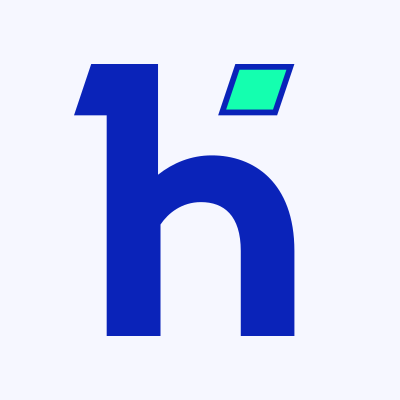

<h1 align="center">Hi 👋, I'm Karlo Lekšić</h1>
<h2 align="center">Curious and adaptable web developer, always striving to grow and innovate.</h2>

    I’m a front-end developer at <a href="https://inchoo.net/" target="blank">Inchoo</a>, specializing in building user-friendly, responsive and high-performance web interfaces. I also have an interest in backend technologies and enjoy tackling simple backend tasks rather than always relying on backend developers for every little thing.

    Previously, I worked as an Embedded Software Developer, which gave me a strong foundation in low-level programming and system optimization.

    Outside of work, I’m passionate about 3D printing, 3D modeling, electronics, DIY projects, music, and chasing adrenaline-filled adventures.

<h3 align="left">Connect with me:</h3>

    
    
    

<h3 align="left">Languages and Tools:</h3>

<h4 align="left">Frontend:</h4>

    
    
    
    
    
    
    
    
    

<h4>Backend:</h4>

    
    

<h4>Version Control:</h4>

    
    
    

<h4>Other:</h4>

    
    
    
    
    

